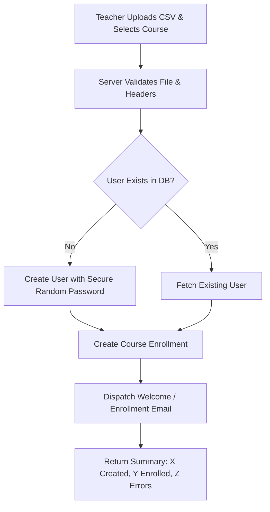

# 📥 Bulk Student Enrollment via CSV — Feature Specification

## 1. Overview & Business Value
Grant funders (Absa, Tshiamo, SETAs) and corporate clients frequently sponsor cohort batches of 20 to 200 learners at once. This feature enables instructors and administrators to upload a single CSV file, automatically provisioning learner accounts, creating course enrollments, and sending branded welcome onboarding emails in one bulk background process.

---

## 2. CSV Schema Format
The system accepts a UTF-8 encoded CSV file with the following headers:
```csv
first_name,last_name,email,id_number,phone
Naledi,Khumalo,naledi.k@example.com,9804120892083,0821234567
Sipho,Dlamini,sipho.d@example.com,9901015829088,0719876543
```

* **first_name** & **last_name**: Required
* **email**: Required (Unique user identifier)
* **id_number**: Optional (SA National ID / Passport for SETA/QCTO certificates)
* **phone**: Optional

---

## 3. Architecture & Processing Flow



---

## 4. UI / UX Placement
* **Teacher Course Analytics / Management Screen**:
  * Added **"📥 Bulk Import Students (CSV)"** button next to SETA Export.
  * Modal with:
    * Downloadable sample CSV template.
    * File dropzone.
    * Option checkbox: *"Send welcome onboarding email to new learners"*.
    * Real-time progress bar & error log report (e.g. invalid emails or duplicates).

---

## 5. Implementation Checklist
- [ ] Add CSV upload endpoint `@teacher_bp.route('/course/<int:course_id>/bulk-enroll', methods=['POST'])`.
- [ ] Add sample CSV download route `@teacher_bp.route('/sample-enrollment-csv')`.
- [ ] Implement asynchronous background processing or batch commit for large files (>100 rows).
- [ ] Send branded welcome email containing login credentials to newly created accounts.
